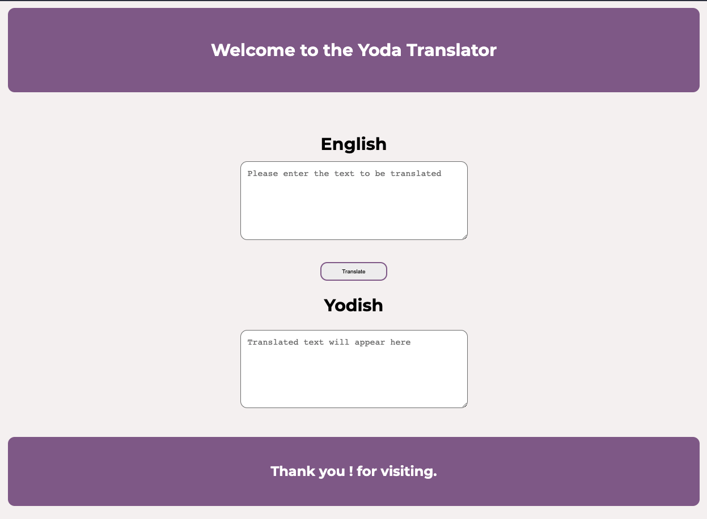
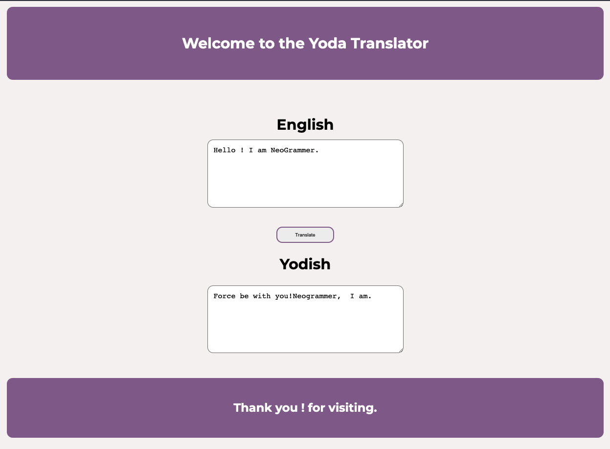

# yoda translator

****

This is a fun app made with vanilla-js basic app which uses the event listener and api to translate the given text into another language which is in this case is a yoda's (remember star wars?😅 ) language.

## screenshots

## resources

### api- https://funtranslations.com/api/yoda
### tutorial- [neoGcamp- Javascript in the Browser](https://www.youtube.com/watch?v=yLZazznWoAs&list=PLzvhQUIpvvuj5KPnyPyWsvgyzNkX_ACPA&index=6)

 ### Note:
 <i>This app is only meant to be run on computer as it is not a responsive . It may look like a total mess if opened on anything other than computer.</i>